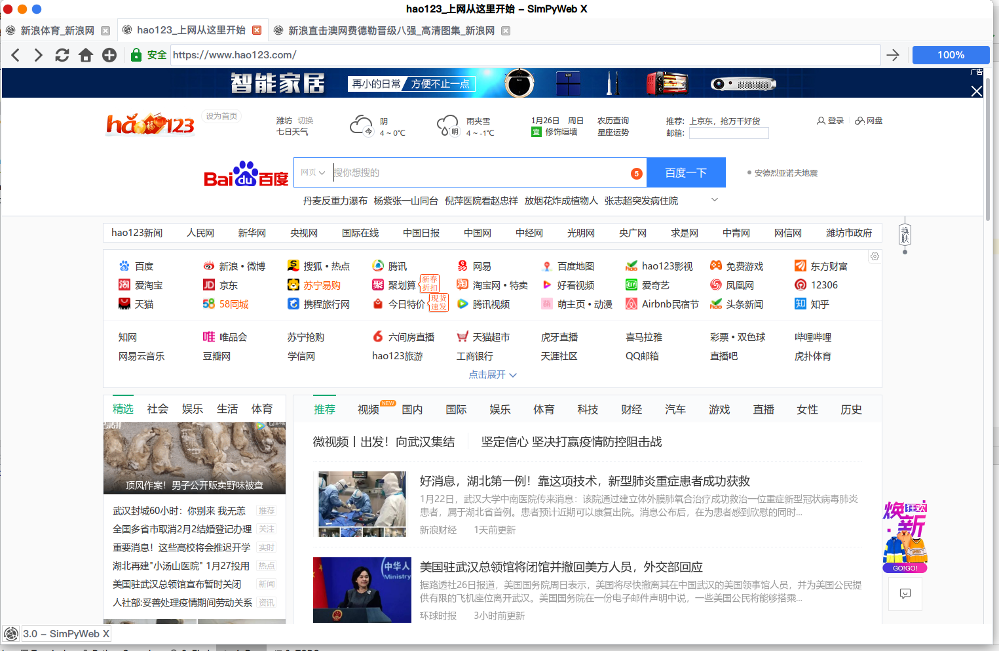

# SimPyWeb X —— 使用PyQt5以及QWebEngineView构建网页浏览器
### 更新说明
**2020.1.26** SimPyWeb X 3.0 诈尸更新，多处修改

### 运行方式
* shell 脚本直接运行
```shell script
python __init__.py
```

* 打包运行（可选择PyInstaller打包）
> https://blog.csdn.net/creeperone/article/details/80957954

### 效果图


### 功能设计
#### 主窗体绘制
* 程序的init函数为启动函数，通过设定窗体的大小，标题，图标等等可以实现窗体的绘制。
```python
def __init__(self, *args, **kwargs):
    super().__init__(*args, **kwargs)
    # 窗体
    self.setWindowTitle(self.name + self.version)
    self.setWindowIcon(QIcon('Assets/main.png'))
    self.resize(1200, 800)
    # 浏览器窗体
    self.browser = QWebEngineView()
    self.browser.load(QUrl("http://www.hao123.com/"))
    self.setCentralWidget(self.browser)
```

#### 工具条实现
* 工具条实现
```python
# 工具条
navigation_bar = QToolBar('Navigation')
navigation_bar.setIconSize(QSize(32, 32))
self.addToolBar(navigation_bar)
```
 
* 工具条按钮以及地址栏
``` python
# 后退按钮
back_button = QAction(QIcon('Assets/back.png'), '后退', self)
# 其他组件
self.url_text_bar = QLineEdit()
```

* 将组件添加到工具条
```python
navigation_bar.addAction(home_button)
navigation_bar.addSeparator()
navigation_bar.addWidget(self.url_text_bar)
```

* 工具条按钮触发事件
```python
# 事件触发
back_button.triggered.connect(self.browser.back)
```

* 获取网页标题
```python
def renew_title(self, s):
    self.setWindowTitle(self.name + self.version + " -- " + s)
```

* 获取网页图标
```python
def renew_icon(self, ico):
    self.setWindowIcon(ico)
```

* 导向地址栏地址
```python
def navigate_to_url(self):
    s = QUrl(self.url_text_bar.text())
    if s.scheme() == '':
        s.setScheme('http')
    self.browser.load(s)
```

* 地址栏重新操作
```python
def renew_urlbar(self, s):
    self.url_text_bar.setText(s.toString())
    self.url_text_bar.setCursorPosition(0)
```

* 进度条设置
```python
    def renew_progress_bar(self, p):
        self.progress_bar.setValue(p)
```

#### 多标签页功能的实现
* 添加标签
```python
    def add_new_tab(self, tab):
        i = self.tabs.addTab(tab, "")
        self.tabs.setCurrentIndex(i)
        tab.back_button.triggered.connect(tab.browser.back)
        tab.next_button.triggered.connect(tab.browser.forward)
        tab.stop_button.triggered.connect(tab.browser.stop)
        tab.refresh_button.triggered.connect(tab.browser.reload)
        tab.home_button.triggered.connect(tab.navigate_to_home)
        tab.enter_button.triggered.connect(tab.navigate_to_url)
        tab.add_button.triggered.connect(self.add_blank_tab)
        tab.set_button.triggered.connect(tab.create_about_window)
        tab.url_text_bar.returnPressed.connect(tab.navigate_to_url)
        tab.browser.urlChanged.connect(tab.renew_urlbar)
        tab.browser.loadProgress.connect(tab.renew_progress_bar)
        tab.browser.titleChanged.connect(lambda title: (self.tabs.setTabText(i, title),
                                                        self.tabs.setTabToolTip(i, title)))
        tab.browser.iconChanged.connect(lambda icon: self.tabs.setTabIcon(i, icon))
```

* 删除标签
```python
    def close_current_tab(self, i):
        if self.tabs.count() > 1:
            self.tabs.removeTab(i)
        else:
            self.close()
```